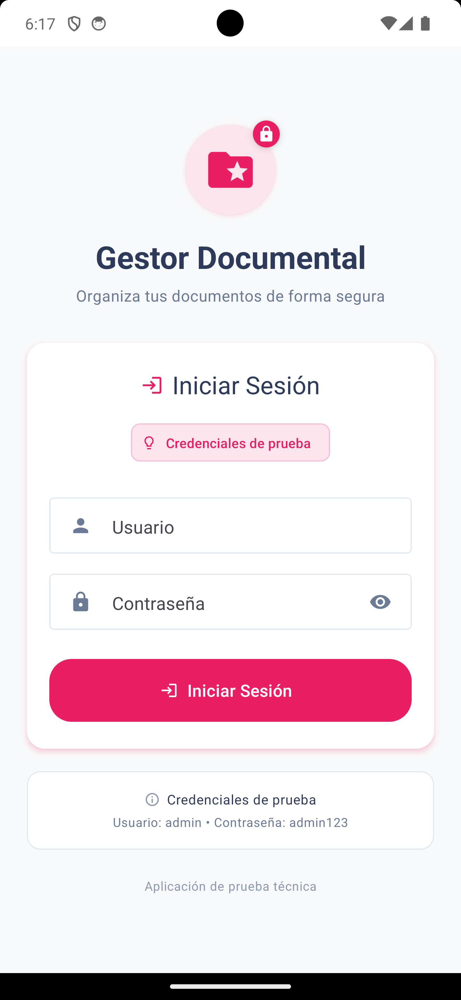
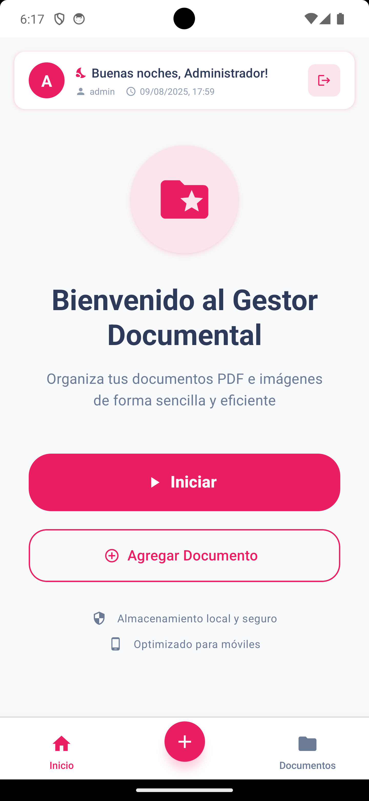
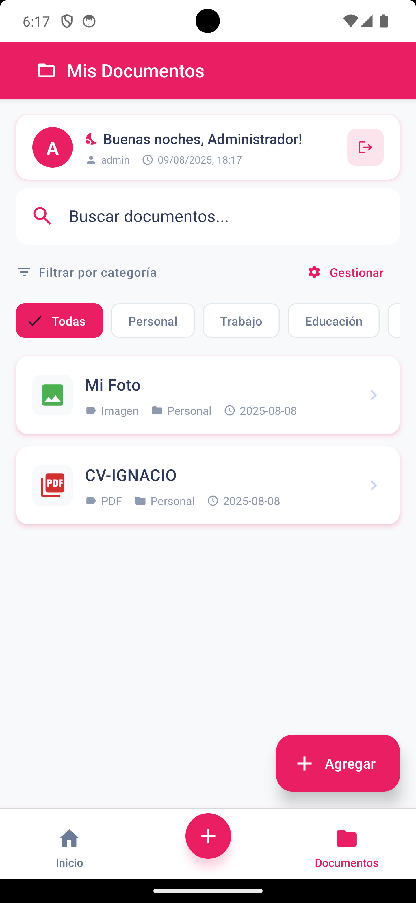
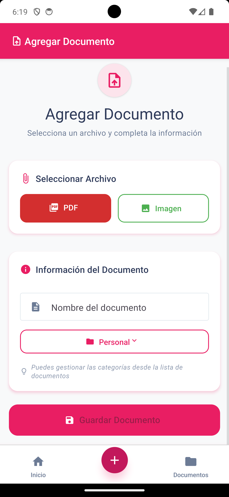
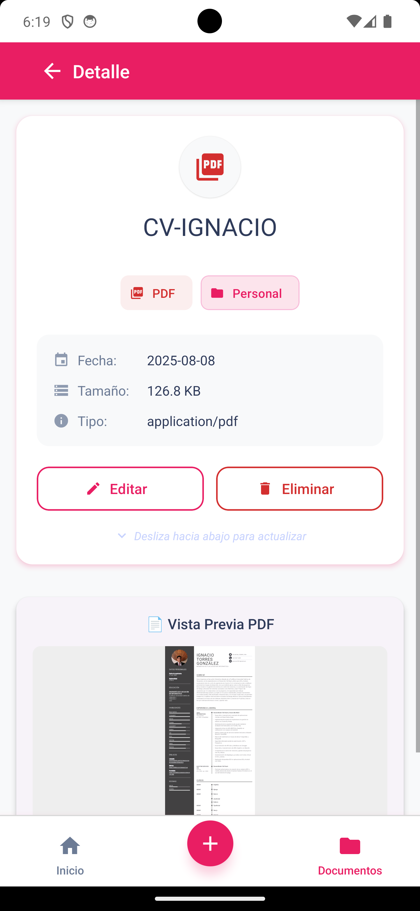
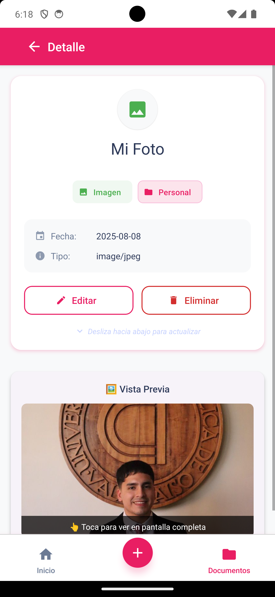
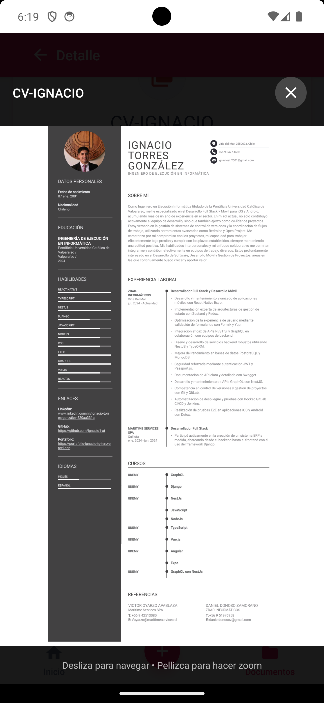
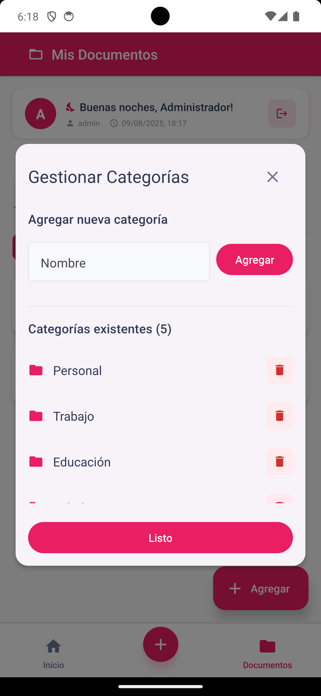
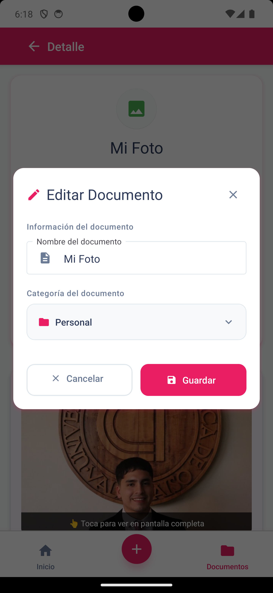

# 📱 Gestor Documental Mobile

> **Prueba Técnica - Aplicación Móvil de Gestión Documental**

Aplicación móvil completa para gestionar documentos PDF e imágenes, desarrollada en **React Native 0.74.5** con **TypeScript**. Permite subir, visualizar, organizar y buscar documentos de forma local con una interfaz moderna y funcional.

[](https://reactnative.dev/)
[](https://www.typescriptlang.org/)
[](LICENSE)

## 🎯 Características Principales

### ✅ **Funcionalidades Implementadas**

- **🔐 Sistema de Autenticación**
  - Login simulado con Zustand para manejo de estado
  - Credenciales de prueba: `admin / admin123`
  - Persistencia de sesión con AsyncStorage
  - Header personalizado con información del usuario
  - Logout con confirmación

- **📄 Gestión Completa de Documentos**
  - **Subida de archivos**: PDFs desde Document Picker e imágenes desde galería/cámara
  - **Almacenamiento local**: AsyncStorage para metadatos y React Native FS para archivos
  - **Metadatos completos**: Nombre, categoría, fecha, tipo, tamaño y URI
  - **Validación de archivos**: Tipos permitidos y manejo de errores

- **🔍 Búsqueda y Filtrado Avanzado**
  - Búsqueda en tiempo real por nombre de documento
  - Filtrado por categorías con chips interactivos
  - Vista de estado vacío con llamadas a la acción
  - Contadores de documentos por categoría

- **📁 Sistema de Categorías Dinámico**
  - **CRUD completo**: Crear, editar y eliminar categorías
  - Gestión inteligente de categorías en uso
  - Categorías por defecto: Personal, Trabajo, Educación, Salud, Finanzas
  - Validación para evitar eliminación de categorías en uso

- **👀 Visualizadores Especializados**
  - **PDF**: Navegación por páginas, zoom, vista pantalla completa con controles
  - **Imágenes**: Vista previa optimizada y modo pantalla completa
  - Manejo robusto de errores de carga
  - Indicadores de progreso y carga

- **✏️ Edición y Gestión**
  - Editar nombre y categoría de documentos existentes
  - Eliminar documentos con confirmación de seguridad
  - Validación de integridad de archivos
  - Pull-to-refresh en pantallas de detalle

- **🧭 Navegación Intuitiva**
  - **Bottom Tab Navigation** con 3 secciones principales
  - **Stack Navigation** para pantallas de detalle
  - Navegación fluida con iconografía clara
  - Estados de carga y transiciones suaves

### ⭐ **Funcionalidades Bonus Implementadas**

- **✅ Sistema de Login**: Autenticación simulada persistente
- **✅ Editar documentos**: Nombre y categoría con validación
- **✅ Eliminar documentos**: Con confirmación y limpieza de archivos
- **✅ Categorías personalizables**: CRUD completo con validaciones
- **✅ Interfaz moderna**: Material Design con UX optimizada
- **✅ Usuario personalizado**: Header con información del usuario logueado

### 🎨 **Interfaz de Usuario**

- **Diseño Material Design** con React Native Paper
- **Temas consistentes** y paleta de colores corporativa (#E91E63)
- **Iconografía clara** con Material Icons y emojis contextuales
- **Experiencia móvil optimizada** para iOS y Android
- **Estados de carga y error** bien manejados
- **Animaciones y transiciones** suaves
- **Componentes reutilizables** y modulares

### 🔒 **Almacenamiento y Seguridad**

- **AsyncStorage** para metadatos de documentos y configuración
- **React Native FS** para gestión segura del filesystem
- **Almacenamiento local** sin dependencias de servicios externos
- **Validación de tipos de archivo** y límites de tamaño
- **Manejo de errores robusto** con feedback claro al usuario

## 🚀 Instalación y Configuración

### 📋 Prerrequisitos

Asegúrate de tener configurado el entorno de React Native siguiendo la [guía oficial](https://reactnative.dev/docs/environment-setup).

**Requerimientos:**
- Node.js 16 o superior
- React Native CLI
- Android Studio (para Android)
- Xcode (para iOS)

### 📥 Instalación

```bash
# Clonar el repositorio
git clone https://github.com/Ignacio1-at/Gestor-Documental-Mobile.git
cd DocumentManager

# Instalar dependencias
npm install

# Para iOS (si es necesario)
cd ios && bundle install && bundle exec pod install && cd ..
```

### ▶️ Ejecutar la aplicación

```bash
# Iniciar Metro Bundler
npm start

# Ejecutar en Android
npm run android

# Ejecutar en iOS
npm run ios
```

### 🔑 Credenciales de Prueba

Para acceder a la aplicación utiliza:
- **Usuario**: `admin`
- **Contraseña**: `admin123`

## 🛠 Tecnologías Utilizadas

### **Core Framework**
- **React Native 0.74.5** - Framework principal para desarrollo móvil multiplataforma
- **TypeScript 5.0.4** - Tipado estático para mayor robustez del código
- **React 18.2.0** - Librería de componentes con hooks modernos

### **Navegación y Estado**
- **React Navigation 7.x** - Sistema de navegación (Bottom Tabs + Stack Navigation)
- **Zustand 5.0.7** - Manejo de estado global ligero y eficiente

### **UI/UX y Diseño**
- **React Native Paper 5.14.5** - Componentes Material Design
- **React Native Vector Icons 10.3.0** - Iconografía completa
- **React Native Safe Area Context** - Manejo de áreas seguras

### **Gestión de Archivos**
- **React Native Document Picker 9.3.1** - Selección de documentos PDF
- **React Native Image Picker 8.2.1** - Captura y selección de imágenes
- **React Native FS 2.20.0** - Sistema de archivos nativo
- **React Native File Viewer 2.1.5** - Visualización de archivos

### **Visualizadores Especializados**
- **React Native PDF 6.7.7** - Visualizador de PDFs con controles avanzados
- **React Native PDF Renderer 2.2.1** - Renderizado optimizado de PDFs

### **Almacenamiento y Persistencia**
- **AsyncStorage 2.2.0** - Almacenamiento local de metadatos
- **React Native Get Random Values** - Generación de UUIDs únicos

### **Herramientas de Desarrollo**
- **ESLint** - Linting y calidad de código
- **Prettier** - Formateo automático de código
- **Jest** - Testing framework
- **Babel** - Transpilación de JavaScript moderno

## 🎨 Capturas de Pantalla

La aplicación cuenta con las siguientes pantallas principales:

### 📱 **Pantallas Principales**

| Pantalla | Descripción | Funcionalidades |
|----------|-------------|----------------|
| **🔐 Login** | Autenticación simulada | Credenciales de prueba, persistencia de sesión |
| **🏠 Home** | Pantalla de bienvenida | Navegación rápida, información del usuario |
| **📋 Lista Documentos** | Explorar documentos | Búsqueda, filtros por categoría, ordenamiento |
| **➕ Agregar Documento** | Subir archivos | Selección PDF/imagen, categorización, metadatos |
| **📄 Detalle Documento** | Vista individual | Visualización, edición, eliminación |
| **📁 Visor PDF** | Visualizador de PDFs | Navegación páginas, zoom, pantalla completa |
| **🖼️ Visor Imagen** | Visualizador de imágenes | Vista previa, pantalla completa |
| **⚙️ Gestión Categorías** | CRUD de categorías | Crear, editar, eliminar categorías |
| **✏️ Editar Documento** | Modificar metadatos | Cambiar nombre y categoría |

### 📸 **Galería de Capturas**

<details>
<summary>📱 <strong>Ver todas las capturas de pantalla</strong></summary>

#### 🔐 **Pantalla de Login**

*Sistema de autenticación con credenciales de prueba*

#### 🏠 **Pantalla de Inicio**

*Bienvenida con navegación rápida y accesos directos*

#### 📋 **Lista de Documentos**

*Vista principal con búsqueda, filtros por categoría y listado*

#### ➕ **Agregar Documento**

*Subida de PDFs e imágenes con categorización*

#### 📄 **Detalle de Documento (PDF)**

*Vista detallada de documento PDF con metadatos y opciones*

#### 📄 **Detalle de Documento (Foto)**

*Vista detallada de imagen con metadatos y opciones*

#### 📁 **Visualizador de PDF**

*Visor de PDFs con navegación por páginas y zoom*

#### 🖼️ **Visualizador de Imágenes**

*Visor de imágenes con modo pantalla completa*

#### ⚙️ **Gestión de Categorías**

*CRUD completo de categorías con validaciones*

#### ✏️ **Editar Documento**

*Modal de edición de nombre y categoría*

</details>

> **🎉 ¡Screenshots listos!** Todas las capturas están ahora disponibles en el README
> 4. Las imágenes aparecerán automáticamente en el README

## ✨ Características Destacadas

### 🔄 **Gestión de Estado Local**
- Persistencia con AsyncStorage para metadatos
- Almacenamiento físico seguro con React Native FS
- Validación de integridad de archivos
- Limpieza automática de referencias rotas

### 🛡️ **Manejo Robusto de Errores**
- Validación completa de archivos
- Estados de error informativos
- Recuperación automática cuando es posible
- Timeouts y reintentos en operaciones críticas

### 📱 **Experiencia Móvil Nativa**
- Navegación optimizada para gestos móviles
- Componentes adaptados a cada plataforma
- Manejo correcto del teclado virtual
- Estados de carga y feedback visual

### 🔍 **Búsqueda y Filtrado Inteligente**
- Búsqueda en tiempo real sin lag
- Filtros combinables (texto + categoría)
- Interfaz intuitiva con chips
- Resultados instantáneos

## 🔧 Solución de Problemas

### Problemas Comunes

```bash
# Limpiar caché completo
npx react-native start --reset-cache
rm -rf node_modules && npm install

# Problemas con Metro
npx react-native start --reset-cache --verbose

# Problemas de permisos en Android
# Verificar permisos en android/app/src/main/AndroidManifest.xml

# Problemas con PDFs en iOS
cd ios && pod install && cd ..
```

### Logs y Debugging

La aplicación incluye logging detallado para facilitar el debugging:
- Estados de archivo y operaciones de copia
- Errores de visualización con contexto
- Operaciones de AsyncStorage
- Validaciones de integridad

## 📄 Licencia y Autoría

**Desarrollado por**: Ignacio Torres 
**Propósito**: Prueba Técnica - Gestor Documental Mobile  
**Fecha**: Agosto 2025  
**Repositorio**: [GitHub - Gestor-Documental-Mobile](https://github.com/Ignacio1-at/Gestor-Documental-Mobile)

---

### 💡 **Estado del Proyecto**

✅ **COMPLETO** - Todos los requerimientos funcionales implementados  
✅ **PROBADO** - Funcionamiento verificado en Android/iOS  
✅ **DOCUMENTADO** - README completo con instrucciones detalladas  
✅ **BONUS** - Funcionalidades adicionales implementadas
